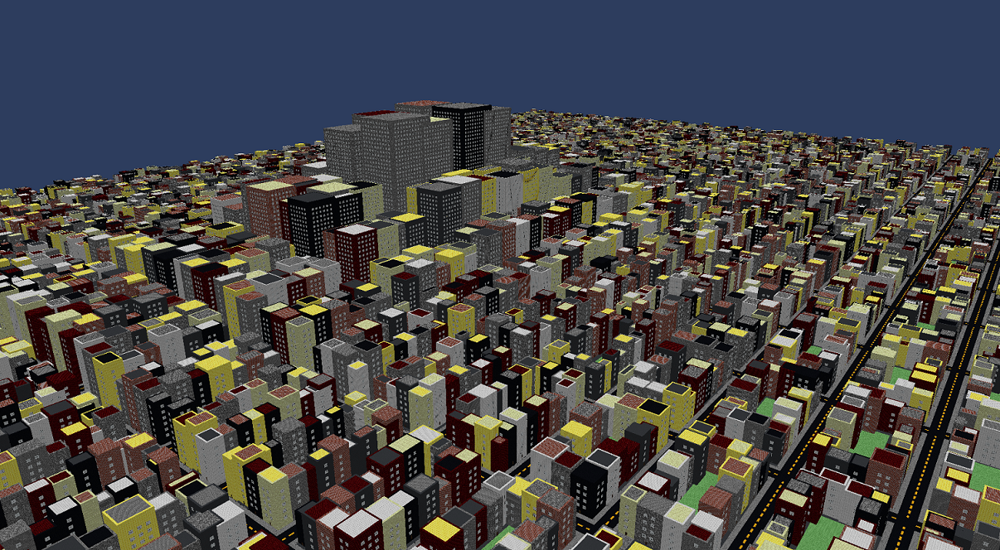

# Cityscape

A blocky city created by combining block meshes of buildings and streets

A 20x20 city may take between 30-60 seconds to generate

# Settings
`#define DAY_CYCLE` - Controls how long each day cycle is. `2PI * x`

`#define CITY_WIDTH 5` - Controls how many city blocks are on the X axis

`#define CITY_DEPTH 5` - Controls how many city blocks are on the Z axis

`#define BLOCK_WIDTH 3` - Controls how many chunks compose a city block on the X axis

`#define BLOCK_DEPTH 6` - Controls how many chunks compose a city block on the Z axis

`#define BLOCK_DIMENSION_VARIENCE 5` - Controls the varience in the width and depths of a building

`#define CITY_HEIGHT_MAX 160` - Controls the base max height of a building in the center of the city

`#define CITY_HEIGHT_MIN 10` - Controls the base minumum height as the buildings move away from the center

`#define CITY_HEIGHT_VARIENCE 10` - Controls the varience in the height of a building

# Controls
`W` - Forward

`A` - Strafe Left

`S` - Backwards

`D` - Strafe Right

`R` - Regenerate City

`SPACE` - Move Up

`CTRL` - Move Down

`MOUSE` - Look

## Extra

#### 1. Road Generation

#### 2. Lighting
1. Diffuse Lighting
2. Ambient Lighting
3. Specular Lighting
4. Normal Mapping
5. Specular Mapping

## Textures Source
[Default Improved v1.12](https://www.curseforge.com/minecraft/texture-packs/default-improved/files/2436467) - 
A Minecraft texture pack containing block textures, normal maps, and specular maps.

By Benjamin Hutchings for CS-4350
2023-12-16